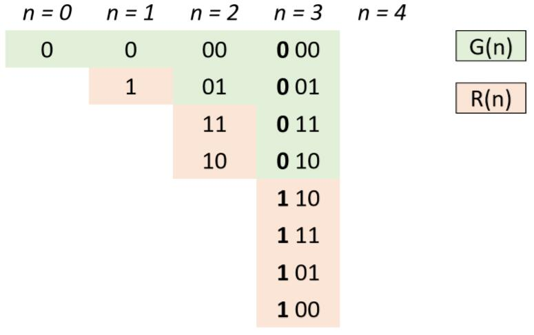

# 固定算法（算式）题目
> MTwz
> 换言之，需要背方法的题目

## 格雷编码
1. 编码形式：两个连续的数值仅有一个位数的差异。例如
    ```
    00 
    01 
    11 
    10 
    ```
2. 编码算式：
    （1）按位异或：` G(i) = i ^ (i/2)`
    ```
        例如 n = 3: 
        G(0) = 000 
        G(1) = 1 ^ 0 = 001 ^ 000 = 001
        G(2) = 2 ^ 1 = 010 ^ 001 = 011 
        G(3) = 3 ^ 1 = 011 ^ 001 = 010
        G(4) = 4 ^ 2 = 100 ^ 010 = 110
        G(5) = 5 ^ 2 = 101 ^ 010 = 111
        G(6) = 6 ^ 3 = 110 ^ 011 = 101
        G(7) = 7 ^ 3 = 111 ^ 011 = 100
    ```
    （2）镜像反射法：
        设 $n$ 阶格雷码集合为 $G(n)$，则 $G(n+1)$ 阶格雷码为：
        给 $G(n)$ 阶格雷码每个元素二进制形式前面添加 $0$，得到 $G'(n)$；
        设 $G(n)$ 集合倒序（镜像）为 $R(n)$，给 $R(n)$ 每个元素二进制形式前面添加 $1$，得到 $R'(n)$；
        $G(n+1) = G'(n) ∪ R'(n)$ 拼接两个集合即可得到下一阶格雷码。
    
3. 题目：【Leetcode】89. 格雷编码
    法1：
    ```JAVA
    public List<Integer> grayCode(int n) {
        List<Integer> ret = new ArrayList<>();
        for(int i = 0; i < 1<<n; ++i)
            ret.add(i ^ i>>1);
        return ret;
    }
    ```
    法2：
    ```JAVA
    public List<Integer> grayCode(int n) {
        List<Integer> res = new ArrayList<Integer>() {{ add(0); }};
        int head = 1;
        for (int i = 0; i < n; i++) {
            for (int j = res.size() - 1; j >= 0; j--)
                res.add(head + res.get(j));
            head <<= 1;
        }
        return res;
    }
    ```